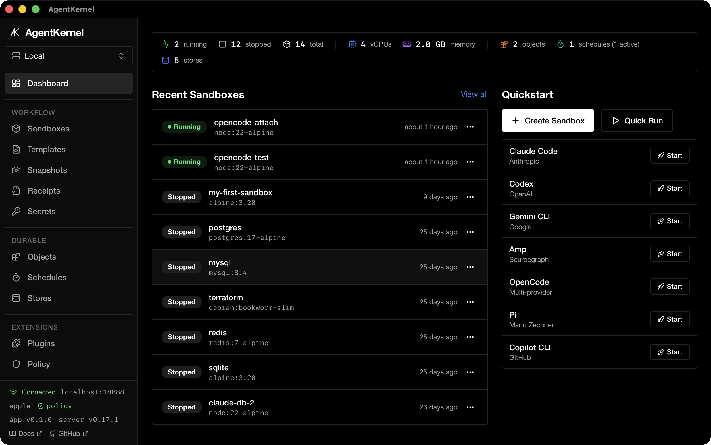

# Desktop App

AgentKernel includes a native macOS desktop app built with [Tauri 2](https://tauri.app/). It provides a GUI for managing sandboxes, snapshots, templates, and agents — all backed by the same HTTP API as the CLI.



## Requirements

- macOS 26+ (Apple Containers) or macOS with Docker Desktop
- The desktop release includes the matching `agentkernel` CLI sidecar and
  starts its local server automatically. Development builds can use an
  installed `agentkernel` on `PATH`.
- A local sandbox backend; the wizard can initialize Apple Containers or open
  Docker Desktop when the runtime is installed but not ready

On macOS, `brew services start agentkernel` runs the HTTP API service. The
separate Firecracker daemon is for Linux hosts with KVM and is not required for
Apple Containers or Docker.

## Install

Download the latest `.dmg` installer from [GitHub Releases](https://github.com/thrashr888/agentkernel/releases):

- **Apple Silicon (M1+):** `AgentKernel_<version>_aarch64.dmg`
- **Intel:** `AgentKernel_<version>_x64.dmg`

Open the DMG and drag AgentKernel to your Applications folder. Alternatively, build from source.

## Build from Source

```bash
# Install dependencies
cd app
npm ci
cd ..

# Run in development mode (hot-reload; builds the local sidecar first)
make app

# Build the matching CLI sidecar for the current target
TARGET=$(rustc -vV | sed -n 's/^host: //p')
cargo build --release --target "$TARGET" --bin agentkernel
mkdir -p app/src-tauri/binaries
cp "target/$TARGET/release/agentkernel" "app/src-tauri/binaries/agentkernel-$TARGET"

# Build release .app bundle (ships the sidecar in the same updater artifact)
cd app
npx tauri build
```

The built `.app` bundle is output to `app/src-tauri/target/release/bundle/macos/`.

## Features

| Page | Description |
|------|-------------|
| Dashboard | Server health, sandbox count, quick actions |
| Sandboxes | Create, start, stop, delete sandboxes with terminal access |
| Sandbox Detail | Exec commands, file browser, live logs |
| Snapshots | Save and restore sandbox state |
| Templates | Quick-launch from predefined configurations |
| Agents | View and install supported AI agent CLIs |
| Policy | View and manage sandbox security policies |
| Secrets | Manage environment secrets passed to sandboxes |
| Audit Log | View sandbox lifecycle events |
| Diagnostics | System health checks and backend status |
| Settings | Configure server connections, toggle the app-owned local server, and set preferences |

## Architecture

```
app/
├── src/                 # React 19 + TypeScript frontend
│   ├── pages/           # Route pages (Dashboard, Sandboxes, etc.)
│   ├── components/      # Shared UI components (shadcn/ui)
│   └── lib/             # API client, hooks, types
└── src-tauri/           # Rust backend (Tauri 2)
    ├── src/commands/    # Tauri IPC commands
    ├── src/api_client.rs # HTTP client to agentkernel server
    └── src/types.rs     # Shared type definitions
```

The desktop app communicates with the `agentkernel serve` HTTP API. Release
bundles contain the matching CLI as a Tauri sidecar, so the Tauri backend starts
an app-owned loopback server during launch and stops it during application
shutdown. The sidecar and desktop app are packaged together, including updater
artifacts, so an update cannot leave the app and server on different versions.

Entries marked as external or remote in Settings are never started or stopped
by the app. This keeps a separately managed local daemon and remote servers
available for development, team, and enterprise deployments.

### Private SSH tunnels

Remote server entries can opt into **Manage tunnel** in Settings. Configure the
SSH host alias (and optionally a user/port) from the user's existing OpenSSH
configuration. The desktop starts `ssh` with `BatchMode`,
`ExitOnForwardFailure`, keepalive options, and an explicit loopback forward to
the remote AgentKernel bind (by default `127.0.0.1:18888`). It chooses a local
loopback port when one is not supplied.

The API client is switched to the local forwarded URL only after a health check
through that tunnel succeeds. Failed startup reports the SSH stderr or an
actionable connection error and cleans up the app-owned child. Switching back
to a direct URL, stopping the tunnel, application exit, and app shutdown stop
only children spawned by this desktop instance. The app never edits
`~/.ssh/config`, kills unrelated SSH processes, or requires the AgentKernel
port to be publicly reachable.

Tunnel-managed entries currently use HTTP over SSH. HTTPS entries remain
direct because a loopback URL would not preserve the remote certificate's
hostname/SNI; use a direct HTTPS URL or HTTP on the private SSH link.
